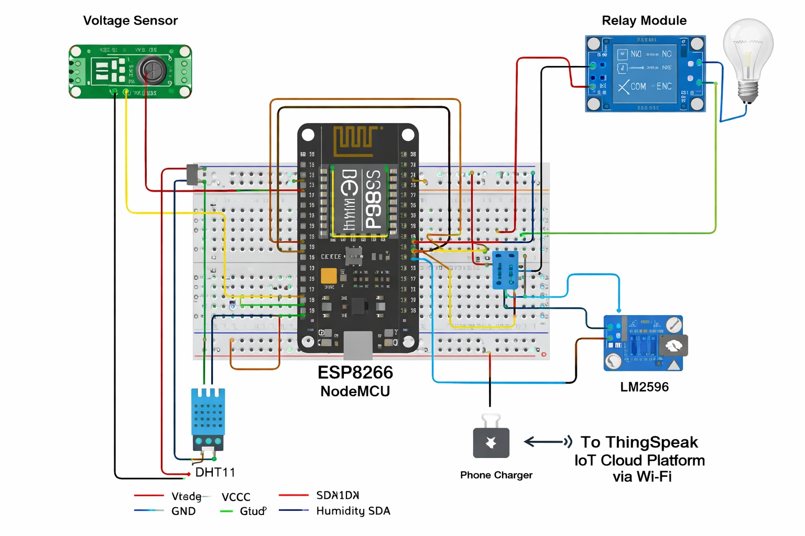
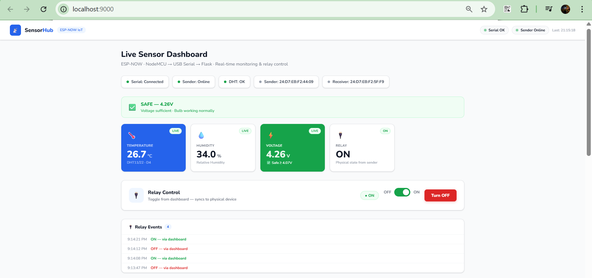

# LoRa-Based Industrial IoT Energy Monitoring System

This project implements a real-time Industrial IoT energy monitoring system using ESP8266 microcontrollers, LoRa communication, and a Python Flask dashboard for live monitoring and relay control.

---

## Features

- Real-time voltage monitoring
- Temperature and humidity sensing
- Long-range wireless communication using LoRa
- Live Flask-based monitoring dashboard
- Remote relay control from dashboard
- Serial communication using PySerial
- Real-time logs and historical sensor visualization

---

## System Architecture

```text
Sensor Node (ESP + Sensors)
        ↓
LoRa Wireless Communication
        ↓
Gateway ESP
        ↓
USB Serial Communication
        ↓
Python Flask Server
        ↓
Real-Time Web Dashboard
```

---

## Tech Stack

### Hardware
- ESP8266 NodeMCU
- LoRa SX1278 module
- DHT11 / DHT22 sensor
- Voltage sensor module
- Relay module
- LM2596 Voltage Regulator

### Software
- Arduino IDE
- Python
- Flask
- PySerial
- HTML
- CSS
- JavaScript

---

# Circuit Diagram

<p align="center">
  
</p>

---

# Live Dashboard

<p align="center">
  
</p>

---

## Project Structure

```text
LongRange-IoT-Energy-Monitoring-System
│
├── dashboard
│   └── main.py
│
├── esp_transmitter
│   └── transmitter.ino
│
├── esp_receiver
│   └── receiver.ino
│
├── images
│   ├── dashboard.png
│   ├── circuit.png
│   └── prototype.jpg
│
└── README.md
```

---

## Running the Dashboard

### Install dependencies

```bash
pip install flask pyserial
```

### Run server

```bash
python main.py
```

### Open browser

```text
http://localhost:9000
```

---

## Future Improvements

- Multi-node LoRa monitoring
- Cloud integration
- Mobile application
- PCB-based industrial hardware
- Secure wireless communication
- Data analytics dashboard

---

## Author

**Partho Roy**  
Electronics & Computer Science Engineering  
KIIT University
